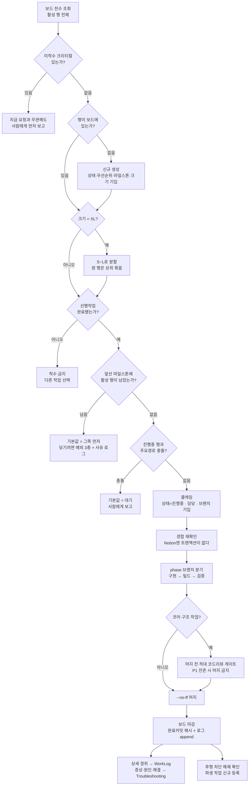
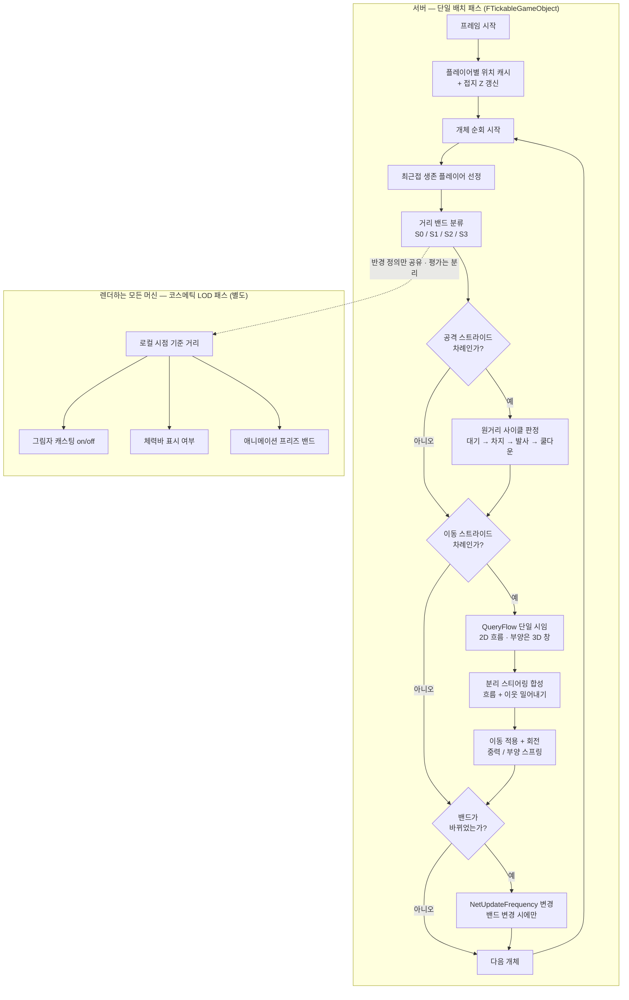
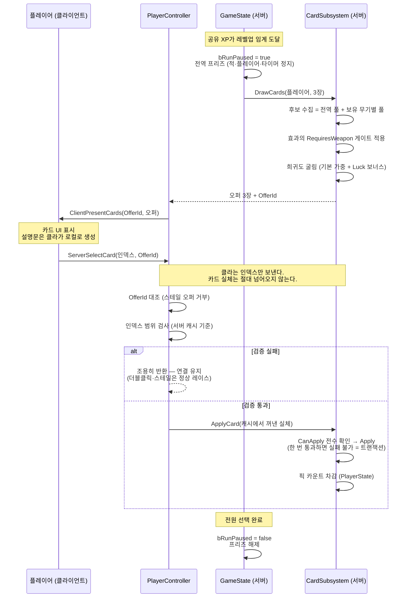

# FPSRoguelite

> **"한 화면이 아니라 한 공간. 사방에서 밀려오는 수백의 스웜을 등지고, 서로의 사각을 지키며 버티는 1인칭 4인 협동 서바이버."**

**Unreal Engine 5.7** · **C++ 약 81,000줄 / 2개 모듈** · **커밋 1,468개** · **ADR 14건** · **자동화 테스트 61개** · 개발 기간 2026-05 ~ 진행 중

1인칭 FPS × 뱀파이어 서바이벌 × 4인 협동 로그라이트. 탑다운 서바이버를 1인칭으로 옮긴 것이 아니라, **1인칭이라서만 가능한 협동**을 만드는 것이 목표다.

이 문서는 기능 목록이 아니라 **의사결정 기록**이다. 각 항목을 `결정 → 근거 → 포기한 것 → 실측` 순으로 적었다.

---

## 목차

1. [프로젝트 개요](#1-프로젝트-개요)
2. [개발 프로세스 — Notion 보드로 일감을 나누고 추적한다](#2-개발-프로세스--notion-보드로-일감을-나누고-추적한다)
3. [언리얼 엔진 기능을 쓴 곳](#3-언리얼-엔진-기능을-쓴-곳)
4. [엔진 밖에서 직접 만든 것 — 왜, 그리고 무엇을 포기했나](#4-엔진-밖에서-직접-만든-것--왜-그리고-무엇을-포기했나)
5. [스웜 시스템 분석](#5-스웜-시스템-분석)
6. [카드 시스템 분석](#6-카드-시스템-분석)
7. [빌드 · 검증](#7-빌드--검증)
8. [저장소 구조 · 문서 지도](#8-저장소-구조--문서-지도)

---

## 1. 프로젝트 개요

### 1.1 장르 정체성

| 축 | 탑다운 서바이버<br>(Vampire Survivors 계열) | 협동 슈터<br>(L4D · DRG 계열) | **이 게임** |
|---|---|---|---|
| 시점 | 탑다운 — 정보 대칭 | 1·3인칭, 적 수십 | **1인칭 — 정보 비대칭** |
| 동시 적 규모 | 수백~수천 | 수십 | **수백 (~200-300)** |
| 협동 성격 | DPS 합, 사실상 병렬 솔로 | 상호의존·역할·엄호 | **상호의존 + 서바이버 스케일** |
| 죽음 | 즉사·재시작 | 다운 → 구출 | **다운 → 구출 (DBNO)** |

**USP는 "1인칭의 제한 시야"다.** 탑다운에서는 화면 하나로 360°가 다 보여 정보 비대칭이 0이고, 협동이 DPS 합에 그친다. 1인칭은 각 플레이어가 제한 FOV라 *"나는 내 앞을, 너는 내 등을 본다"* 는 상호의존이 **시스템으로 강제**된다. 탑다운에서는 버그였을 사각 무방비가, 협동에서는 설계 공간이 된다.

협동의 대상은 잡몹 전체가 아니라 **희소하고 선명한 위협**(원거리 적 · 다운된 팀원 · 사각)이다. 1인칭에서 수백 마리를 팀 단위로 조율하는 건 불가능하므로, 잡몹은 시야를 압박하는 배경장으로 두고 협동을 희소 위협으로 좁혔다.

### 1.2 제1원리 — 적 수백 마리를 싸게

모든 아키텍처 결정의 기준은 하나다:

> **적을 동시 ~200-300마리 싸게 굴려야 한다. 액터당 비용 최소화가 다른 모든 편의보다 우선한다.**

이 한 문장이 아래 §4의 자체 구현 9건 전부의 근거다. 엔진 기본값은 "액터가 수십 개"라는 전제 위에 서 있는 경우가 많고, 그 전제가 깨지는 지점에서만 직접 만들었다. 그렇지 않은 곳은 전부 엔진 것을 그대로 쓴다(§3).

### 1.3 규모

| | |
|---|---|
| C++ | 382 파일 · 81,079줄 · 런타임 모듈 1 + 에디터 모듈 1 |
| 런타임 도메인 | 21개 폴더 (`Enemy` `Card` `Weapon` `Arena` `Run` `AbilitySystem` `Combat` …) |
| 커밋 | 1,468 (`docs` 445 · `feat` 286 · `fix` 229 · `merge` 154 · `content` 140) |
| 아키텍처 결정 기록(ADR) | 14건 |
| 자동화 테스트 | 61개 (Flow-Field · 풀 · 예산 산술 · 카드 CSV 왕복 · 세이브 · 스테이지 전환 …) |
| 콘텐츠 DataAsset | 90개 |

> 커밋 타입 1위가 `feat`가 아니라 `docs`(445건)인 것은 의도된 결과다. 이 프로젝트는 결정의 **근거와 기각된 안**을 남기는 것을 산출물의 일부로 취급한다 — 그 이유는 다음 절에 있다.

---

## 2. 개발 프로세스 — Notion 보드로 일감을 나누고 추적한다

### 2.1 왜 git 문서가 아니라 Notion인가

처음에는 `PROGRESS.md` 하나에 작업 현황을 적었다. 그러다 실제 사고가 났다 — **다른 세션의 커밋이 내 phase 브랜치에 얹혔다.** 원인은 단순했다.

> **git 문서는 브랜치-로컬이다. 머지되기 전에는 병렬 작업자끼리 서로가 안 보인다.**
> → **공유 가변 상태는 git 밖에 살아야 한다.**

그래서 2026-08-07에 작업 현황·우선순위·선행관계·핸드오프의 SSOT를 전부 Notion DB로 이관했다. `PROGRESS.md`는 보드로 가는 포인터만 남겼다. 설계 문서(변하지 않는 결정)는 git에, 작업 현황(계속 변하는 상태)은 Notion에 — **성질이 다른 두 데이터를 같은 저장소에 두지 않는다**는 것이 이관의 논지다.

**하드 게이트**: 커밋을 낳는 작업은 **보드 클레임 없이 착수 금지**. 이 규칙이 없으면 보드는 반쯤 비어 있는 채로 신뢰를 잃는다.

### 2.2 보드 스키마 — 4개 축

작업 1건은 서로 직교하는 4개 축으로 기술된다.

| 축 | 값 | 의미 |
|---|---|---|
| **상태** | 대기 / 진행중 / **검증중** / **결정대기** / 차단 / 보류 / 완료 / **폐기** | 지금 무엇을 기다리는가 |
| **우선순위** | 크리티컬 / 하이 / 미듐 / 로우 / 백로그 | 그 마일스톤 *안*에서의 순서 |
| **마일스톤** | M0 기준선 … M6 정식 1.0 | 언제 — 슬라이스 순서 |
| **크기** | S / M / L / XL | 상대 크기 (달력 기간이 **아니다**) |

축을 나눈 이유가 각각 있다.

- **`검증중`** — 사람이 PIE·에디터에서 직접 확인해야 끝나는 것. 자동화가 집을 수 없는 작업이라 세션 시작 조회에서 **일부러 제외**한다. 넣었더니 활성 목록이 17건 → 29건으로 불어 신호를 잃었다.
- **`결정대기`** — 진행이 막힌 게 아니라 **사람의 결정을 기다리는** 상태. `차단`과 섞으면 "내가 답하면 풀리는 것"이 안 보인다.
- **`완료` vs `폐기`** — 원래는 `폐기`가 없어서, 접은 트랙도 `완료`로 넣고 사유를 본문에 적는 우회를 썼다. 그러면 나중에 **"완료 = 실제로 해낸 것"으로 셀 수 없다.** 이제 갈라 쓴다. 폐기 행은 지우지 않는다 — 지우면 "왜 안 했는지"가 사라져 같은 걸 다시 착수하게 된다.
- **`크리티컬`은 사람 전용** — 에이전트가 스스로 부여하거나 강등할 수 없다. 유일하게 마일스톤 순서를 무시하는 인터럽트라 권한을 나누면 순서 규율이 무너진다.

**마일스톤 개시 규칙**: `M(n)`의 Exit Criteria를 통과하기 전에 `M(n+1)` 행을 착수하지 않는다. 예외는 셋뿐 — ① 크리티컬 ② 현행 빌드를 깨는 회귀·크래시 ③ **뒤 슬라이스의 판정을 오염시키는 결함**. 예외로 당겨 쓰면 사유를 행 로그에 남긴다(조용한 순서 위반 금지).

> 실제로 이 규칙이 순환 의존을 한 번 잡았다. 아트 적용은 M2 소속인데 M0의 Exit 조건이 "아트 적용 후 성능 측정"을 요구하고 있었다 — 개시 규칙상 **M0을 영원히 못 닫는 구조**였다. 원문 Exit Criteria를 다시 읽어 그 요구가 원래 없었다는 것을 확인하고 정정했다.

### 2.3 일감 분할 — `XL`은 클레임하지 않는다

크기 축의 존재 이유가 여기다.

| 크기 | 정의 |
|---|---|
| `S` | 1세션 |
| `M` | 2~3세션 |
| `L` | 4세션 이상 |
| `XL` | **크기를 못 재겠거나 4세션으로도 안 끝난다 = 쪼개야 한다** |

> 🔒 **`XL` 행은 클레임하지 않는다.** 착수 전에 `S`~`L` 행들로 **분할한 뒤** 착수한다. 원 행은 상위 묶음으로 남기거나 폐기한다.

근거는 완료 판정이다. 크기를 못 재는 작업은 "끝났다"를 판정할 수 없고, 판정할 수 없는 작업은 상태 축이 의미를 잃는다. 분할하면 각 조각이 독립적으로 완료·검증되고, 중간에 세션이 끊겨도 인계 지점이 명확하다.

경계 정의도 한 번 고쳤다. 처음 정의는 `M`=2~3세션 / `L`=여러 세션 **+ 검증**이었는데, ① "2~3세션"이 "여러 세션"의 부분집합이라 겹쳤고 ② "+검증"은 **모든 작업의 공통 의무**라 변별력이 0이었다. 상호배타로 다시 정의한 것이 위 표다.

실제 분할 사례 — "적 스웜 렌더 경로 확정"(원래 XL)은 착수 전에 4조각으로 쪼갰다: ① A/B 대조 스파이크 + 실측 → ② 판정·ADR 작성 → ③ 콘텐츠 배선 → ④ 이월 검증 항목 등록. 조각 ①이 예상과 반대 결과(대조군 전제가 뒤집힘)를 내면서 ③의 범위가 바뀌었는데, 쪼개져 있었기 때문에 ①만 완료로 닫고 ③을 다시 쓸 수 있었다.

### 2.4 작업 1건의 라이프사이클



**클레임 7단계**(조회 → 크리티컬 확인 → 행 확보 → 선행 확인 → 병렬 충돌 검사 → 클레임 → **경합 재확인**)에서 마지막 단계가 특히 중요하다. **Notion에는 트랜잭션이 없다.** 클레임 직후 행을 다시 읽어 담당이 나인지 확인하지 않으면, 동시에 같은 행을 집은 다른 세션의 값이 조용히 내 값을 덮는다.

### 2.5 보드는 stale해진다 — 드리프트 감사

보드는 사람이 갱신을 빠뜨리면 틀린다. 그래서 **git이 1차 진실**이고, 보드는 git과 주기적으로 대조한다.

| | 감사 항목 |
|---|---|
| D1 | 유령 진행중 — 브랜치 칸이 비었거나 그 브랜치가 실재하지 않음 |
| D2 | 정체 — 브랜치는 있으나 최근 커밋이 없음 |
| D3 | 완료 미머지 — `완료커밋` 해시가 `main`에 없음 |
| D4 | 머지 미마킹 — `main`에 머지됐는데 행이 아직 진행중 |
| D5 | 선행 해제 누락 — 선행이 완료됐는데 후행이 아직 차단 |
| D6 | 크리티컬 미착수 |
| D7 | 경합 — 진행중 행끼리 `주요경로` 공유 |

### 2.6 문서 계층 — 무엇을 어디에 적는가

작업 현황(Notion)과 별개로, **git에는 변하지 않는 것**을 적는다. 종류별로 목적지가 다르고, 같은 내용을 두 곳에 적지 않는다(이중 SSOT 금지).

| 문서 | 담는 것 | 성질 |
|---|---|---|
| [`Game.md`](Game.md) | SSOT 허브 — 장르 정체성 + **라우팅 가이드**(작업 종류 → 읽을 파일) | 얇게 유지 |
| [`Docs/SSOT/*.md`](Docs/SSOT) | 도메인별 설계 정본 (전투·적·성능·런루프·아트·워크플로 등 12개) | 설계가 바뀌면 **코드보다 먼저** 갱신 |
| [`Docs/Architecture/*.md`](Docs/Architecture) | **ADR** — 결정 + 그 이유 + **기각된 안** + **미해소 반론** | 뒤집혀도 **고치거나 지우지 않는다** |
| [`Docs/WorkLog.md`](Docs/WorkLog.md) | 끝난 작업의 상세 경위 (최신순, 원문 보존) | append only |
| [`Docs/Troubleshooting.md`](Docs/Troubleshooting.md) | 증상 → 원인 → 해결 | 막히면 여기부터 |

**ADR 규칙이 이 체계의 핵심이다.** 결정이 뒤집혀도 기존 문서를 수정하지 않고, 상태를 `대체됨(→ NNNN)`으로 바꾼 뒤 새 번호로 새 문서를 만들어 서로 링크한다.

> *"결론만 적힌 문서는 몇 주 뒤에 같은 논의를 처음부터 반복하게 만든다. 토론 과정을 보존하는 것이 이 문서들의 절반이다."*

실제로 1인칭 팔 구조는 ADR 0002 → 0003 → 0004 → 0005 → 0006으로 다섯 번 뒤집혔다. 0004·0005는 대체됐지만 **그 안의 실측치와 함정 기록**(FBX의 m↔cm 100배 문제, rest pose 미러, "본 잔차 0/65"가 스켈레톤 공유 중엔 아무것도 증명하지 못한다는 것)은 지금도 유효해서, 자체 리그를 다시 만들 일이 생기면 그 둘부터 읽게 되어 있다. 지웠다면 전부 다시 겪었을 것이다.

ADR에는 되돌리기 비용도 함께 적는다. **`저렴` 등급(나중에 바꿔도 국소 수정으로 끝나는) 결정은 아예 기록하지 않는다** — 전부 남기면 인덱스가 신호를 잃기 때문이다.

### 2.7 AI 어시스트 워크플로

이 프로젝트는 AI 에이전트를 개발에 상시 사용하고, **Human-on-the-Loop** 규약 아래 운용한다. 읽기·조사·초안은 자동으로 돌지만, 파일 수정·커밋·외부 호출 같은 고위험 작업은 사람의 승인을 거친다.

핵심 안전장치는 **머지 전 적대 코드리뷰 게이트**다. 코어·구조 변경은 머지 직전에 별도 인스턴스의 리뷰어가 diff를 공격적으로 검토하며, **설계 변호를 리뷰 프롬프트에 싣지 않는 것**이 독립성의 성립 조건이다. 심각도 P1이 하나라도 남아 있으면 머지가 금지되고, 지적을 기각하려면 근거(제1원리 조항 / 코드 인용 / 실측치)를 대야 한다. **지적 0건은 통과 근거로 인정하지 않는다** — 무엇을 봤는지가 비어 있으면 리뷰가 돌지 않은 것으로 본다.

---

## 3. 언리얼 엔진 기능을 쓴 곳

액터가 소수(플레이어 1~4, 보스 1)인 영역에서는 엔진 표준을 그대로 쓴다. 직접 만든 것은 §4에만 있고, 그 경계는 **"적 수백 마리가 지나가는 경로인가"** 하나다.

| 엔진 기능 | 어디에 | 그대로 쓴 이유 |
|---|---|---|
| **Gameplay Ability System** | 플레이어 전원(ASC는 `PlayerState` 소유) + 엘리트 적. 무기 발사 GA 4종(히트스캔 / 발사체 / 차지레이저 / 근접), 글로벌 어트리뷰트(Luck·Crit·MoveSpeed·MaxHealth·PickupRadius·XPGain) | 개체 수가 최대 4라 GAS의 복제·태그·GE 비용이 문제되지 않는다. 카드 효과를 `SetByCaller` GE로 얹는 구조가 그대로 성립 |
| **Enhanced Input** | 이동·사격·ADS·대시·무기 슬롯 1/2/3 | 표준. IMC 매핑은 에디터에서 저작 |
| **CommonUI** + Activatable Widget Stack | 메뉴 · 로비 · 카드 선택 · 설정 오버레이 · HUD | 스택 기반 입력 라우팅과 게임패드 포커스를 직접 만들 이유가 없다 |
| **Push Model 복제** | 적 체력 3개 프로퍼티, 무기 인벤토리, 런 상태(`bRunPaused`·공유 XP) | 적 수백의 복제 비교 비용을 없애는 가장 싼 레버 |
| **CharacterMovementComponent** | 플레이어 이동 전체 (+ 서브클래스로 슬라이드·월 동작·충돌무시 대시) | 예측·보정을 직접 만드는 비용이 이득을 압도한다 |
| **`CustomPrimitiveData`** + Mesh Draw Command 동적 인스턴싱 | 적 애니메이션 상태 전달 (§4.7) | 엔진의 드로우 병합을 **깨지 않고** per-primitive 값을 보내는 유일한 통로. 엔진 기본 경로를 덮지 않는다 |
| **OnlineSubsystem (Steam)** + SteamSockets | 리슨 서버 호스팅, Steam 친구 초대 join, 세션 정리 | 공개 매칭이 스코프 밖(친구 4인 협동)이라 얇은 래퍼로 충분 |
| **DataValidation** (`IsDataValid`) | 무기·카드 풀·런 스케줄·로드아웃 DataAsset 불변식 검사 | 저작 실수를 에디터에서 잡는다. 검증기 6종이 이 위에 있다 |
| **Automation Testing** | 61개 — Flow-Field 알고리즘, 풀 수명주기, 예산 산술, 카드 CSV 왕복, 세이브 버전, 스테이지 전환 | 월드 없이 도는 순수 단위 테스트로 잘라 두면 헤드리스로 몇 초에 돈다 |
| **Slate / 에디터 모듈** | `FPSRogueliteEditor` — Data Editor · 아레나 저작 툴 · 무기 조립기 · 블록아웃 배치 모드 | §4.8 |
| **SaveGame** | 버전드 `USaveGame` + 강제 경유 `GameInstanceSubsystem` | 표준 |
| **GameplayTag** | 데미지 타입 · 코스메틱 채널 · HUD 상태 | 문자열 대신 계층 태그 |

### 3.1 정직성 항목 — enable ≠ 사용

`.uproject`에 활성화되어 있지만 **현재 코드가 쓰지 않는 플러그인**이 셋 있다.

| 플러그인 | 실제 상태 |
|---|---|
| `SignificanceManager` | **미사용.** 실제 티어링은 직접 짠 거리 밴드이고, 이동 패스와 융합돼 있다 (§4.3) |
| `StateTree` / `GameplayStateTree` | **미사용.** 보스 AI 확장 지점으로 예약되어 있으나 아직 붙지 않았다 |
| `AnimToTexture` | **런타임 코드에서 폐기.** 적 비주얼이 절차적 스태틱 메시로 바뀌면서 VAT 백엔드(`UFPSREnemyAnimProfile_VAT_CPD`)를 삭제하고 `_Proc`로 대체했다. 플러그인과 베이크된 콘텐츠 애셋은 남아 있으나 현재 렌더 경로가 아니다 |

앞의 둘은 2026-08-11 문서↔코드 드리프트 감사에서 잡힌 것이다. 그때까지 설계 문서에는 *"보스/엘리트 = 일반 Actor + StateTree (+GAS)"* 라고 적혀 있었는데, 실제로는 **엘리트 클래스 자체가 없었고** 보스에도 둘 다 붙어 있지 않았다. **문서가 코드보다 앞서 있으면 그건 계획이지 사실이 아니다** — 감사에서 문서를 코드에 맞춰 내렸다. (엘리트 GAS는 그 뒤 [ADR 0013](Docs/Architecture/0013-enemy-tier-axis-and-elite-gas.md)으로 실제로 들어왔고, **보스 GAS·StateTree는 지금도 미장착**이다.)

마찬가지로 **Chaos 파괴는 C++ 코드에 없다.** 파괴 가능 오브젝트(`AFPSRDestructible`)는 적 체력 컴포넌트를 재사용해 체력·파괴 판정만 서버에서 처리하고, 부서지는 연출은 BP 콘텐츠에 맡긴다.

**미구현으로 남은 것**(계획이지 현황이 아님): 보스 GAS·StateTree, ReplicationGraph, 4인 동시 복제 실측.

---

## 4. 엔진 밖에서 직접 만든 것 — 왜, 그리고 무엇을 포기했나

전부 §1.2의 제1원리에서 나왔다. 각 항목은 `문제 → 엔진 기본안 → 왜 안 되나 → 자체 구현 → 포기한 것` 순이다.

### 4.1 길찾기 = Flow-Field (NavMesh + BehaviorTree 대체)

- **엔진 기본안**: NavMesh + `AIController` + BehaviorTree, 개체마다 `MoveTo`
- **왜 안 되나**: 개체별 경로 탐색은 마릿수에 선형으로 붙고, `AIController`는 적 1마리당 액터 하나를 더 만든다. 200~300마리에서는 둘 다 성립하지 않는다
- **자체 구현**: 고정 맵을 격자로 나눠 플레이어에서 출발하는 BFS로 거리장을 만들고, 그 기울기를 흐름 벡터로 굽는다. 적은 자기 칸의 벡터를 **O(1) 샘플**로 읽어 그 방향으로 밀린다. 재계산은 0.2초 주기 + 지형 변화(문 파괴 등) 시 해당 칸을 `blocked→open`으로 stamp 후 단일 BFS 재실행
- **분리 설계**: 격자·BFS·흐름 알고리즘은 월드를 모르는 순수 클래스(`UFPSRFlowFieldComputer`)로 빼서 단위 테스트가 가능하다. 월드 서브시스템은 경계 볼륨 발견·타이머·라우팅만 소유
- **포기한 것**
  - 동적 장애물 회피 — 격자는 정적 지형만 안다. 움직이는 방해물은 분리 스티어링으로만 처리
  - 개체별 경로 다양성 — 같은 칸의 적은 같은 방향으로 간다. 개성은 분리력·속도 변주로만 낸다
  - 셀 상한 — `MaxTotalCells=40000` / `MaxGridDimPerAxis=256`을 넘으면 **조용히 품질을 낮추지 않고 fail-fast로 잠근다**. 맵 크기가 콘텐츠 계약이 된다

> 이 상한이 실제로 설계를 한 번 되돌렸다. 다중 맵 심리스 추격을 설계하던 중, 당시 맵 하나가 이미 36,200 / 40,000 셀을 쓰고 있다는 것이 확인됐다 — **다중 맵이 이미 물리적으로 불가능**했다. 단일 아레나로 피벗했다([ADR 0010](Docs/Architecture/0010-arena-topology-and-stage-transition.md)).

### 4.2 적 체력 = 비-GAS 경량 컴포넌트

- **엔진 기본안**: GAS `AttributeSet` + `GameplayEffect`로 데미지
- **왜 안 되나**: 적 1마리마다 ASC + AttributeSet + GE 핸들이 붙는다. ASC 하나의 복제 비용(어트리뷰트 셋 + 어빌리티 스펙 + GE 핸들)은 일반 티어가 쓰는 `UActorComponent` 하나를 압도한다
- **자체 구현**: `UFPSREnemyHealthComponent` — 단순 `UActorComponent` 하나. 데미지는 GAS를 거치지 않고 `FPSRCombatStatics::ApplyDamage` 단일 지점으로 들어온다. 플레이어 쪽 GAS 계산(크리티컬·배율)의 **결과값만** 이 브릿지로 넘어온다. 실드 층·약점 판정도 여기에 얹었다
- **적용 범위**: 스웜 일반 티어 · **엘리트** · **보스** 전부 같은 컴포넌트를 쓴다. 엘리트가 GAS를 갖는 것은 어빌리티·GE 전용이고 체력은 여전히 이쪽이다. 엘리트는 **동시 마릿수 하드캡 8**로 묶인다
- **포기한 것**: 적에 GE·태그 기반 상태이상(도트·슬로우 스택)을 얹을 수 없다. 필요하면 이 컴포넌트에 직접 만들어야 한다. 시간 기반 GE는 아예 금지

### 4.3 시뮬레이션 = 배치 틱 + 직접 짠 거리 밴드 significance

- **엔진 기본안**: 액터별 `Tick` + `SignificanceManager` 플러그인
- **왜 안 되나**: 액터별 Tick은 300개의 개별 함수 호출 + 캐시 미스다. `SignificanceManager`는 범용이라 우리가 필요한 것(**이동 스트라이드·공격 스트라이드·복제 주파수를 한 번에 결정**)과 모양이 맞지 않는다
- **자체 구현**: 적의 `Tick`을 전부 끄고, 스폰 서브시스템이 `FTickableGameObject`로 **한 패스에 전 개체를 순회**한다. 그 패스가 거리 밴드를 계산해 세 소비처를 동시에 결정한다 (§5.3)
- **이중 평가의 이유**: 서버 significance와 **클라이언트 코스메틱 LOD는 별도 패스**다. 서버 패스에서 코스메틱까지 결정하면 호스트만 절약하고 원격 클라이언트는 300마리 코스메틱을 전부 그린다 — *"솔로에서는 문제없음"* 이 되는 정확한 형태라 분리했다. 반경 정의만 한 헤더에서 공유해 "가깝다"의 뜻이 갈라지지 않게 했다
- **포기한 것**: 플러그인의 튜닝 UI·범용성. 밴드 수치는 코드 상수라 바꾸면 빌드가 필요하다

### 4.4 액터 수명 = 풀링 + 휴면 풀

- **엔진 기본안**: `SpawnActor` / `Destroy`
- **왜 안 되나**: 초당 수십 마리가 죽고 태어나는 게임에서 스폰·소멸은 GC 압력과 히치로 직결된다
- **자체 구현**: 스폰 서브시스템 안에 풀을 인라인. 죽은 적은 파괴되지 않고 숨겨진 채 **클래스별 버킷**으로 들어가, 같은 아키타입 요청 시 O(1)로 나온다. 죽음 직후에는 시체가 잠시 남았다가(dwell) 풀로 돌아간다
- **`Mass`/ISM을 안 쓴 이유**: 실측 결과 풀 액터가 예산 안에 들어왔다(§5.5). 인스턴싱 전환이 요구하는 수명주기 기구(슬롯 핸들·generation·이주·단일 기록자)를 **필요하지 않은데 미리 지불하지 않는다**. 규모가 수천 단위로 바뀌면 그때 꺼내 쓸 수 있게 설계는 문서로만 보존했다
- **포기한 것**: 재사용마다 **리셋 계약**을 손으로 지켜야 한다. 서버는 활성화 시점, 클라이언트는 숨김 setter 오버라이드에서 이전 생의 상태를 지운다. 하나라도 빠뜨리면 유령 시체·잔존 체력바로 나타난다

### 4.5 메시징 = GameplayMessageSubsystem 경량 재구현

- **엔진 기본안**: Lyra의 `GameplayMessageRouter` 플러그인 — **엔진에 포함되어 있지 않다**
- **자체 구현**: 태그 채널 기반 로컬 pub/sub 서브시스템. 정확 매칭 / 하위 태그 포함 매칭 2종, 핸들 기반 해제. **복제 0** — 히트·사망 코스메틱이 이 위로 다니고, 복제되는 액터 상태로 승격되지 않는다
- **왜 중요한가**: 코스메틱을 복제 상태로 만들면 적 300마리의 이펙트가 전부 대역폭이 된다. 로컬 버스로 내리면 0이 된다
- **포기한 것**: Lyra 업스트림을 따라갈 수 없다. 대신 표면이 작아 전체를 읽는 데 몇 분이면 된다
- **함정 기록**: 이벤트 배선은 **권위·클라이언트 두 반쪽**이다. `OnRep`에만 붙이면 호스트에서 안 나고, 권위 콜백에만 붙이면 원격 클라이언트에서 조용히 안 난다

### 4.6 부양 적 = 플레이어 중심 국소 3D 창 필드 ([ADR 0009](Docs/Architecture/0009-hover-swarm-local-3d-flow-window.md))

- **문제**: 2D 흐름장은 평면만 안다. 떠다니는 적이 건물을 넘거나 단차를 오르게 하려면 세로 정보가 필요하다
- **처음 시도**(ADR 0008): "도달 불가면 3D 시크로 전환". PIE에서 결함 2개가 바로 드러났다
  1. **전역 일제 상승** — 도달성은 플레이어에서 출발하는 BFS라, 플레이어가 도달 불가 지점에 올라서는 순간 **맵 전체의 흐름이 0**이 된다. 전 개체가 동시에 3D 모드로 들어가 스웜이 한 판처럼 떠올랐다. "막힌 개체만 국소적으로"를 의도했는데 트리거가 전역 신호였다
  2. **점프 동조 출렁임** — 목표 고도가 플레이어의 순간 Z에 묶여, 점프 한 번에 전 개체 고도가 동시에 오르내렸다
- **전제 전환**: 서바이버형 + 비가시 근거리 스폰이면 적의 실이동 거리는 **20~40m**다. 우회·터널 통과·단차 상승은 전부 플레이어 코앞에서 벌어진다 — **원거리 경로 품질 문제가 아니라 근거리 품질 문제**다. 이 인식이 "월드 전체를 덮는 3D 필드"라는 대안 셋의 공통 전제를 깼다
- **자체 구현**: 2D 전역 필드는 그대로 두고, **플레이어 주위에만 작은 3D 창**을 띄워 그 안에서만 세로를 푼다. 목표 고도는 플레이어의 **마지막 접지 Z**(순간 Z가 아니라)로 잡아 점프 동조를 구조적으로 없앴다. 이동 소비자가 필드를 읽는 지점은 `QueryFlow` **단 하나**로 좁혀, 뒤의 필드를 갈아끼워도 국소 수정으로 끝나게 했다
- **포기한 것**: 창 밖의 경로 품질. 멀리 있는 적은 여전히 2D 평면 해답만 받는다. 예산을 근거리에 몰아준 대가다
- **안전장치**: 지상 적은 창의 자유공중 기울기를 받지 못하게 게이트를 걸었다 — 오를 수단이 없는 개체에 수직 방향을 주면 수평 조향이 0이 되어 **영구 스톨**한다

### 4.7 렌더 = CustomPrimitiveData ([ADR 0007](Docs/Architecture/0007-enemy-swarm-render-path-cpd.md))

- **문제**: 적 300마리에게 서로 다른 애니메이션 상태(대기/이동/공격/사망 + 진입 시각 + 재생률 + 위상)를 전달해야 한다
- **처음 안**: 적마다 Dynamic Material Instance(MID)를 만들어 파라미터를 쓴다 → **머티리얼이 개체마다 분화되어 엔진의 드로우 병합이 깨진다**
- **검토한 대안**: ISM/Niagara 인스턴싱 전환 — 수명주기 기구(슬롯 핸들·generation·이주 원자성·이중 백엔드) 6건이 새로 필요
- **자체 구현**: 개별 `StaticMeshComponent`를 그대로 두되 **머티리얼은 전 개체가 공유**하고, 상태는 `CustomPrimitiveData` 슬롯 5개로 per-primitive 전달. UE5의 Mesh Draw Command 동적 인스턴싱은 같은 메시+같은 머티리얼 컴포넌트를 병합하며, **CPD는 그 병합을 보존하는 통로**다. 엔진 기본 경로를 덮지 않고 그대로 쓴다
- **실측 (Development 패키지 · 리슨 호스트 · 60m 링 스폰 · 고정 카메라)**

  | | **CPD (채택)** @300 | MID (대조군) @300 | CPD @500 |
  |---|---|---|---|
  | 프레임 평균 | **5.48ms (182fps)** | 6.48ms (154fps) | 7.11ms (141fps) |
  | 스웜 렌더 합계 | **2.05ms** | 2.68ms | 3.03ms |
  | RHI 드로우콜 | **445** | 529 | 562 |

- **전제가 뒤집힌 지점**: 착수 전 가설은 *"지배항은 개별 컴포넌트 수"* 였다. 실측은 아니었다 — **배칭을 깨는 것은 컴포넌트 수가 아니라 per-actor MID**였다. 스파이크를 먼저 돌리지 않았다면 필요 없는 ISM 전환에 몇 주를 썼을 것이다
- **포기한 것**: 슬롯 계약(무엇을 몇 번 슬롯에 싣는가)을 사람이 관리한다. 풀 재사용 시 이전 생의 CPD가 남지 않도록 리셋 시임을 서버·클라이언트 양쪽에 둬야 한다. 적 BP에서 `CreateDynamicMaterialInstance` 호출은 금지 — 하나라도 부르면 그 개체가 병합에서 빠진다

### 4.8 저작 도구 = 전용 에디터 모듈

밸런스 값이 전부 DataAsset에 있으면 **바꾸기는 쉬운데 한눈에 보기가 어렵다.** 그래서 별도 에디터 모듈(`FPSRogueliteEditor`)을 만들었다.

| 도구 | 하는 일 |
|---|---|
| **FPSR Data Editor** (Slate) | 카드·무기·풀 값을 격자로 놓고 **일괄 산술**. 단위가 섞인 선택(퍼센트 + 플랫)에는 덧셈을 금지한다 |
| **카드 CSV 파이프라인** | `Cards.csv` + `CardCatalog.csv` → 커맨드릿 임포트 → DataAsset. 왕복 테스트로 무손실 보장 |
| **아레나 저작 툴 + 검증기** | 아레나 골격을 저작하고 불변식을 **저작 시점에** 검사 |
| **무기 조립기** (전용 뷰포트 2종) | 모듈러 파츠를 붙이고 1인칭 시점으로 바로 확인 |
| **블록아웃 배치 모드** | 레벨 화이트박스 배치 + 검증 |
| **검증기 6종** | 카드 풀(ID 중복 = 세이브 키 충돌) · 무기 · 로드아웃 · 런 스케줄 · 아레나 베이크 · 블록아웃 |
| **로컬라이징 커맨드릿** | CSV → StringTable, 에디터 실행 중 리로드 |

- **핵심 원칙**: 검증기가 읽는 상수는 **런타임 코드의 것을 그대로 참조**한다. 모듈이 달라서 복사하고 싶어지지만, 복사하면 한쪽을 튜닝하는 순간 조용히 어긋난다. 그래서 캡 상수들이 `public`으로 열려 있다
- **포기한 것**: 유지보수 대상 코드가 늘었다. 대신 밸런스 작업이 텍스트 편집에서 도구 작업으로 바뀌었다

### 4.9 서버 RPC 규약 = `WithValidation` 미채택

- **엔진 기본안**: Server RPC에 `_Validate`를 달아 잘못된 입력을 거른다
- **왜 안 되나**: UE 5.7 엔진 소스를 따라가면 `_Validate`가 false를 반환할 때 벌어지는 일은 "걸러내기"가 아니다.
  `RPC_ValidateFailed`(`CoreNet.cpp`) → `ReceivedRPC` false(`DataReplication.cpp`) → **`Connection->Close(...)`**(`DataChannel.cpp`) — **강제 퇴장**이다
- **결정적 근거**: 거부 사유의 절반은 악의가 아니라 **정상 레이스**다. 스테일 오퍼, 더블클릭. `_Validate`로 올리면 **더블클릭한 정상 플레이어가 킥된다**
- **자체 규약**: 검사는 `_Implementation` 몸통에서 하고, 유효하지 않으면 **아무 일도 하지 않고 반환**한다. 클라이언트는 **인덱스만** 보내고 실체(카드·무기)는 서버가 자기 캐시에서 꺼낸다 — 실체 주입이 구조적으로 불가능하다
- **제1원리 근거**: 4인 친구 협동이라 치터가 망치는 건 자기 파티뿐이고 랭킹·경제·PvP가 없다. **오탐 킥의 손실 > 억지력.** Server RPC 12개가 이미 전부 안전하게 거부하므로 `_Validate`가 더하는 건 보호가 아니라 처벌뿐이다
- **포기한 것 / 재검토 조건**: 유효한 값을 대량 전송하는 스팸은 이 규약으로 막지 못한다(엔진 전용 계층 소관, 현재 꺼져 있음). **경쟁 요소(랭킹·매치메이킹)가 들어오면 이 규약을 재검토한다** — 그때는 결론이 뒤집힌다

---

## 5. 스웜 시스템 분석

### 5.1 서버 1패스 파이프라인

적은 개별 `Tick`을 갖지 않는다. 스폰 서브시스템 하나가 프레임마다 전 개체를 순회하며 아래를 처리한다.



**두 패스를 나눈 것이 설계의 핵심이다.** 서버 significance는 "누가 위협인가"를, 코스메틱 LOD는 "누가 보고 있는가"를 답한다. 멀티플레이에서 이 둘은 다른 질문이라 합칠 수 없다.

### 5.2 예산 3층

동시 마릿수 상한이 **세 개의 다른 층**에 있고, 각각 뜻이 다르다. 이 구분이 문서에서 한 번 뭉개져 있었고, 감사에서 정정했다.

| 층 | 값 | 뜻 |
|---|---|---|
| ① `MaxActiveEnemies` | **500** | **풀 액터 상한**. 누적 스폰 기준이며 **동시 생존 상한이 아니다** |
| ② `GlobalAliveCap` − `SeedReserve` | 250 − 10 = **240** | **동시 생존 실효 천장.** 모든 스폰 경로가 통과하는 하드 게이트 = 엔지니어링 천장. 실측으로만 움직인다 |
| ③ `MaxAliveCount` (DataAsset) | 240 (C++ 기본값) | 디자이너가 **더 조일 수만 있는** 운영 상한. 현재 런 스케줄 애셋에 저작된 적이 없어 기본값 그대로다 |
| — `EliteHardCap` | **8** | 엘리트 동시 마릿수. 곡선과 무관하게 이 값을 못 넘는다 |

- **`SeedReserve` 10의 이유**: 예산이 포화된 상태에서도 새 전선이 열리면 즉시 적을 뿌릴 헤드룸이 필요하다. 없으면 진입 직후 몇 초가 비어 버린다
- **`EliteHardCap` 8의 이유**: 엘리트는 ASC를 갖는다. 어트리뷰트 셋 + 어빌리티 스펙 + GE 핸들의 복제 비용이 일반 티어의 `UActorComponent` 하나를 압도한다. 캡이 없으면 §1.2의 제1원리가 무너진다

### 5.3 거리 밴드 LOD — 하나의 분류가 세 곳을 결정한다

| 밴드 | 거리 | 이동 스트라이드 | 공격 스트라이드 | 복제 주파수 |
|---|---|---|---|---|
| **S0** 근접 위협 | ≤ 15m | 1 (매 프레임) | 1 | 30Hz |
| **S1** 근거리 | ≤ 35m | 2 | 1 | 10Hz |
| **S2** 중거리 군집 | ≤ 60m | 4 | 2 | 5Hz |
| **S3** 원거리 | > 60m | 8 | 4 | 2Hz |

- **공격 스트라이드가 항상 이동 스트라이드 이하**인 이유: 공격 지연은 이동 지연보다 체감이 크다. 그리고 원거리 교전 사거리가 S1 안에 들어와 있어 **차지는 언제나 스트라이드 1에서 일어난다**
- **위상 분산**: 스트라이드 게이트는 `(프레임 카운터 + 개체 고유 ID) % 스트라이드`로 판정한다. 개체 ID를 더하지 않으면 같은 밴드의 적이 **전부 같은 프레임에** 깨어나 스파이크가 된다
- **복제 주파수는 밴드가 바뀔 때만 쓴다** — 300마리 핫패스에서 매 프레임 setter를 부르지 않는다

### 5.4 복제 계약 — 딱 3개

적이 복제하는 것은 **Transform + 체력 컴포넌트의 3개 프로퍼티**(`Health` · `MaxHealth` · `bDead`)뿐이고, 전부 Push Model이다.

- `MaxHealth` — 클라이언트가 체력바 **비율**을 계산하려면 필요하다. 스폰 때 한 번만 바뀌므로 지속 비용은 사실상 0
- `bDead` — `Health <= 0`에서 파생 가능한데도 남긴다. **풀 재사용 때 `true→false` 전이를 클라이언트가 놓치지 않게 하는 엣지 감지**용이다. *비트 하나보다 엣지 감지 정확성이 우선* — 적을 재사용하는 구조라 놓친 전이는 곧 유령 시체·체력바 잔존으로 나타난다
- 히트·사망 코스메틱은 복제 상태가 아니라 **로컬 메시지 버스**로 다닌다 (§4.5)

### 5.5 실측 — M0 베이스라인 (2026-08-31)

패키지 Development 빌드 · 리슨 호스트 · 60m 링 스폰 후 수렴 · PlayerStart 고정 카메라 · 워밍업 10초 절삭.

| 구성 | 요청 | 정착 생존 | 프레임 평균 | P95 | GameThread | GPU | 스웜 렌더 합 | 드로우콜 |
|---|---|---|---|---|---|---|---|---|
| 300 · 셀셰이딩 on | 300 | **259** | **4.41ms (227fps)** | **4.82ms** | 2.58ms | 4.00ms | **1.19ms** | 168 |
| 300 · off | 300 | 254 | 4.26ms (235fps) | 4.88ms | 2.67ms | 3.84ms | 1.23ms | 180 |
| 500 · 셀셰이딩 on | 500 | **423** | **4.59ms (218fps)** | 5.31ms | 3.82ms | 4.10ms | 1.25ms | 186 |
| 500 · off | 500 | 428 | 4.40ms (227fps) | 5.43ms | 3.87ms | 3.79ms | 1.18ms | 175 |

**판정선 대비**: 적 300에서 평균 ≥60fps · P95 ≤20ms → **227fps · 4.82ms**(여유 3.8~4.1배). 스웜 렌더 ≤4ms → **1.19ms**(3.4배). 적 500에서 ≥30fps → **218fps**(7.3배).

### 5.6 이 수치를 인용할 때의 단서 — 숨기지 않는다

1. **「요청」과 「정착 생존」이 다르다.** 스폰 명령은 요청 수를 정확히 채웠지만(`delivered 300/300`), t≈3~4초에 300→259로 떨어지고 평평해진다. 원인은 **60m 스폰 링의 일부가 아레나 바닥 밖**에 걸리는 것 — 접지 스냅이 아래 100m 안에서 바닥을 못 찾으면 후보 좌표를 그대로 돌려주고, 그 공중 좌표의 적이 낙하해 Kill-Z에서 회수된다(102m 자유낙하 ≈ 3~4초, 관측과 일치). 종전에는 이 손실에 **로그가 한 줄도 없어 완전히 무음**이었고, 지금은 패스당 집계 로그가 있다. → **"적 300에서 쟀다"고 인용하면 안 된다.** 판정 여유가 3.8~7.3배라 41마리(13.7%) 차이로 결론이 뒤집히지 않는다는 판단으로 마감한 것이고, 이는 외삽이다
2. **1인 리슨 호스트 단독 측정이다.** 표 어디에도 인원 축이 없다. **4인 복제 축은 미측정**이며, 시나리오·러너·판정선(`ServerReplicateActors` 평균 ≤1.5ms @300×4클라)은 이미 등록되어 있으나 아직 실행되지 않았다
3. **패키지 빌드에서는 Push Model이 컴파일 아웃된다.** 비교 기반 복제로 폴백하며(동작은 정상, 의도한 CPU 절감 없음), 위 수치는 **그 상태 그대로** 잰 것이다 — 현재 아키텍처의 실비용이므로
4. **씬이 비어 있다.** 현행 아레나는 블록아웃이라 GPU BasePass가 0.07ms, 즉 래스터라이즈되는 것이 사실상 없다. **출시 아트가 들어오면 이 여유는 줄어든다**
5. **`NetCullRadius` 괴리** — 단일맵 기본값 200m인데 현행 아레나는 160×160m다. 한 변이 반경보다 짧아 플레이어가 중앙 근처면 **relevant ≈ alive 전량**이다. 해법은 ReplicationGraph(공간 relevancy) 소관이며 **아직 도입하지 않았다**

> 복제 도구 평가 순서는 **Push Model(현재) → 부하 시 ReplicationGraph → 그래도 부족하면 Iris(Beta) 평가**로 잡혀 있다. Iris를 1순위에 두지 않은 이유는 RepGraph가 "다수 액터 · 연결별 relevancy" 병목에 더 직접적이기 때문이다.

---

## 6. 카드 시스템 분석

레벨업·미션 클리어마다 **전역 프리즈**를 걸고 전원이 카드를 고른다. 런 내 성장의 전부가 이 시스템 위에 있다.

### 6.1 구조 — 폴리모픽 효과 (개방-폐쇄 원칙)

카드는 효과를 **직접 알지 않는다.** 추상 베이스 `UFPSRCardEffect`의 인라인 서브오브젝트 배열을 소유할 뿐이고, 적용 루프는 타입을 모른 채 `ResolveMagnitude` → `Apply`만 돈다.

| 효과 서브클래스 | 하는 일 |
|---|---|
| `Character: Gameplay Effect` | 플레이어 ASC에 GE 적용 (`SetByCaller`로 수치 주입) |
| `Character: Passive Ability` | 패시브 어빌리티 부여 |
| `Weapon: Stat Modifier` | 무기 스탯 수정 (이 무기만 / 전 무기 선택 가능) |
| `Weapon: Behavior Fragment` | 무기에 행동 조각 부여 (관통·폭발·도트 등) |
| `Grant Weapon (Unlock)` | 새 무기 해금 |

> **새 효과 타입을 추가하는 비용 = 서브클래스 1개(약 40줄), 중앙 코드 수정 0.**

이게 말뿐이 아닌 이유는, 확장 지점이 **런타임뿐 아니라 에디터 툴까지** 가상 함수로 뚫려 있기 때문이다. 새 서브클래스가 `GetEditorEligibleRoutes()`(어느 드로우 루트에 놓일 수 있는가) · `GetEditorMagnitudeUnit()`(퍼센트인가 플랫인가)만 구현하면, Data Editor의 라우팅 프리플라이트와 일괄 산술 안전장치에 **자동으로 편입**된다. 중앙에 `switch`가 하나도 없다.

**수치는 효과별로 매긴다.** 카드는 희귀도 하나를 굴리지만 각 효과가 자기 `RarityTiers`에서 자기 수치를 읽으므로, 한 카드 안에서 *"연사 +15% / 데미지 −8%"* 처럼 서로 다르게 스케일하는 게 가능하다.

### 6.2 라우팅 2축 — 어디서 뽑히고 무엇을 소비하는가

**드로우 루트**(카드가 어느 배열에 사는가)는 C++ 멤버라 **닫힌 집합**이고, **효과**는 열린 축이다. 효과가 자신이 허용하는 루트를 선언하고, 도구가 그 교집합을 검사한다.

| 드로우 루트 | 언제 뽑히는가 |
|---|---|
| `LevelUpGlobal` | 레벨업 — 전역 풀 (캐릭터 / 전 무기 대상) |
| `LevelUpWeapon` | 레벨업 — **보유한** 무기의 전용 풀 |
| `MissionClearNewWeapon` | 미션 클리어 — 새 무기 해금 |
| `MissionClearWeaponFeature` | 미션 클리어 — 무기 기능 해금 |

| 오퍼 타입 | 소비 | 리롤 |
|---|---|---|
| `OpeningSeed` | 런 시작 시드 2장 — **아무것도 소비하지 않는다** | 가능 |
| `LevelUp` | 레벨업 픽 1개 소비 | 가능 |
| `WeaponUnlock` | 무기 해금 픽 1개 소비 | **불가** |

**희귀도 × Luck**: 풀이 등급별 기본 가중치를 갖고, 플레이어의 Luck 어트리뷰트가 등급별 보너스를 더한다. Luck은 광역 행운으로 통합되어 있어(별도 RarityBonus는 폐지) 앞으로 드랍 품질·희귀 스폰에도 같은 스탯이 쓰인다.

### 6.3 서버 권위 흐름



세 가지가 이 흐름의 핵심이다.

1. **클라이언트는 인덱스만 보낸다.** 카드·무기 실체는 서버 캐시에서 꺼낸다 — 실체 주입이 **구조적으로 불가능**하다
2. **거부는 조용히 한다.** 스테일 오퍼·더블클릭은 악의가 아니라 정상 레이스다 (§4.9)
3. **적용은 트랜잭션이다.** `CanApply()`가 완전한 사전조건 검사를 하므로 `Apply()`는 실패할 수 없다. 이게 없으면 "픽은 소비됐는데 효과가 안 붙은" 상태가 생기고, 프리즈가 풀리지 않아 **소프트락**이 된다

**전역 프리즈**(`bRunPaused`)는 서버 권위 플래그 하나지만, 이걸 존중해야 하는 곳이 많다. 반동 컴포넌트는 프리즈 중 카메라를 드리프트시키면 안 되고, 진행 중인 타이머는 명시적으로 일시정지해야 하며, **클라이언트와 서버 양쪽에 게이트가 필요**하다. 한쪽만 걸면 예측과 권위가 갈라진다.

### 6.4 저작 파이프라인 — CSV가 원천

카드가 수십~수백 장이 되면 DataAsset을 하나씩 여는 건 성립하지 않는다.

```
Cards.csv          ─┐
  카드 1장 = 1행     │
  효과는 E1~E3       ├─→  임포트 커맨드릿  ─→  DA_Card_*.uasset
  컬럼군으로 평탄화   │         │
CardCatalog.csv    ─┘         │
  AttrId → 효과 타입 매핑      ↓
  (char.maxhealth 등)     검증기 · 라운드트립 테스트
```

- **`CardId`가 세 역할을 겸한다** — CSV 행 키 · **세이브 파일 키** · 로컬라이징 키 접두. 그래서 풀 검증기가 **ID 중복을 에러로 잡는다**(중복 = 세이브에서 해금이 서로를 덮어씀)
- **표시 문자열은 CSV가 원천**이고 DataAsset에는 StringTable 참조가 들어간다 — 한/영/일 3개 열
- **왕복 테스트**(`FPSRCardCsvRoundTripTest`)가 export → import → export 무손실을 보장한다
- **Data Editor의 라우팅 프리플라이트**: 부적격 루트에 카드를 놓으면 런타임에 **조용한 no-op**이 된다(뽑히지 않거나 의미 없는 오퍼가 됨). 조용한 실패는 디버깅이 가장 비싸므로 **경고가 아니라 하드 에러**로 막는다

### 6.5 트레이드오프

| 얻은 것 | 대가 |
|---|---|
| 효과가 인라인 서브오브젝트라 **복제 0** — 카드 정보가 네트워크를 타지 않는다 | 카드 애셋이 커지고, 항상 로드된 상태여야 한다 |
| 새 효과 = 서브클래스 1개, 중앙 0 수정 | 폴리모픽 `Instanced`는 UObject 직속 `TArray`에서만 쓴다(struct 중첩은 이 리포에서 미검증이라 회피) |
| 밸런스 값이 전부 데이터 — 코드 재빌드 없이 조정 | 값이 흩어져 **도구 없이는 밸런싱이 불가능** → 그래서 §4.8을 만들었다 |
| 클라이언트가 설명문을 로컬 생성 — 텍스트 복제 0 | 서버·클라이언트가 같은 수치 해석 규칙을 각자 돌린다(어긋나면 표시만 틀림) |

---

## 7. 빌드 · 검증

### 빌드

```bash
"<엔진루트>/Engine/Build/BatchFiles/Build.bat" FPSRogueliteEditor Win64 Development -Project="<클론>/FPSRoguelite.uproject" -WaitMutex
```

- ⚠️ **판정은 종료 코드가 아니라 로그의 `Result:` 줄로 한다.** 출력을 리다이렉트하면 종료 코드가 0으로 뒤집힌다
- ⚠️ **머지 전 1회는 `-DisableAdaptiveUnity -ForceUnity`를 붙인다.** UBT의 Adaptive Unity가 "방금 고친 파일"을 유니티 블롭에서 자동으로 빼기 때문에, 수정 직후의 `Succeeded`는 유니티 충돌(익명 네임스페이스 동명 심볼)을 **구조적으로 못 잡는다**. 이 함정으로 2회 재발한 기록이 있다
- 라이브 코딩은 사용하지 않는다 — 다른 클론의 에디터가 켜져 있으면 같은 엔진의 다른 워킹트리 빌드까지 막는다

### 자동화 테스트

```bash
UnrealEditor-Cmd.exe <uproject> -unattended -nopause -nullrhi -nosplash -nosound \
  -ExecCmds="Automation RunTests FPSRoguelite.Smoke.ModuleLoads" -TestExit="Automation Test Queue Empty"
```

61개 중 상당수가 **월드 없이 도는 순수 단위 테스트**다 — Flow-Field 격자·BFS, 예산 산술, 거리 밴드 분류, 휴면 풀 수명주기, 카드 CSV 왕복, 세이브 버전 마이그레이션. 알고리즘을 월드 의존에서 떼어낸 덕분에 몇 초 만에 돈다.

> 함정: 테스트 이름을 `A+B+C`로 묶어 넘기면 러너가 아예 돌지 않고 에디터가 영원히 대기한다. 개별 호출이 정답이다.

### 성능 계측

`Scripts/measure_swarm_render.ps1` — 고정 시나리오(링 스폰 → 수렴 → 고정 카메라)로 프레임·GameThread·GPU·스웜 렌더 서브예산·드로우콜을 CSV로 뽑고, `Scripts/analyze_swarm_csv.py`가 평균·P95를 낸다. §5.5의 표가 이 러너의 출력이다.

---

## 8. 저장소 구조 · 문서 지도

```
Source/
├── FPSRoguelite/              런타임 모듈 (21개 도메인)
│   ├── Enemy/                 스웜 풀액터 · 체력 · Flow-Field · 부양 창 · 스폰 디렉터 · 메트릭
│   ├── Card/                  카드 DataAsset · 폴리모픽 효과 · 풀 · 드로우 서브시스템
│   ├── Weapon/                무기 인스턴스 · 발사 · 반동 · 발사체 · 행동 조각 · 인벤토리
│   ├── AbilitySystem/         ASC · 어트리뷰트 셋 · 발사 GA 4종 · 패시브
│   ├── Combat/                데미지·팀·연결성 게이트 (전 무기 경로의 단일 지점) · 실드 · 약점
│   ├── Arena/                 아레나 액터 · 셀 · 베이크 · 검증기 · 스트리밍
│   ├── Run/                   런 디렉터 · 스케줄 · 스테이지 전환 · 미션
│   ├── Core/                  GameMode · GameState · PC · PS · 세션 · 게임 플로우
│   ├── Hero/                  플레이어 캐릭터 · 무브먼트 · 부활 · 사각 오디오 · 피드백
│   ├── Boss/  Director/  Destructible/  Pickup/  Map/  Anim/  Audio/
│   ├── Messages/              경량 GameplayMessage 서브시스템
│   ├── MetaProgression/  Settings/  UI/  CityGen/
│   └── Tests/                 자동화 테스트
└── FPSRogueliteEditor/        에디터 모듈
    ├── DataEditor/            밸런스 일괄 편집 Slate 툴
    ├── CardImport/            카드 CSV ↔ DataAsset 파이프라인
    ├── Arena/  Blockout/      아레나 저작 · 화이트박스 배치 모드
    ├── Assembler/             무기 조립기 (뷰포트 2종)
    ├── Validation/            검증기 6종 + 커맨드릿
    └── Localization/          CSV → StringTable
```

### 어디를 읽을 것인가

| 알고 싶은 것 | 문서 |
|---|---|
| 컨셉 · USP · 타겟 · 포지셔닝 | [`Docs/SSOT/Concept.md`](Docs/SSOT/Concept.md) |
| 런 루프 · 레벨업 · 프리즈 · 미션 · 보스 | [`Docs/SSOT/RunFlow.md`](Docs/SSOT/RunFlow.md) |
| 무기 · 카드 · 조각 · 사격 감각 | [`Docs/SSOT/CombatWeaponCard.md`](Docs/SSOT/CombatWeaponCard.md) |
| 적 스웜 · 스폰 · 발사체 · 네트워크 | [`Docs/SSOT/Enemy.md`](Docs/SSOT/Enemy.md) |
| 카메라 · DBNO · 게임필 · HUD | [`Docs/SSOT/PlayerFeel.md`](Docs/SSOT/PlayerFeel.md) |
| 기술 스택 · 모듈 구조 · RPC 규약 | [`Docs/SSOT/Architecture.md`](Docs/SSOT/Architecture.md) |
| 성능 · 복제 예산 · Flow-Field | [`Docs/SSOT/Performance.md`](Docs/SSOT/Performance.md) |
| 빌드 · 브랜치 · 리뷰 게이트 · PM 보드 프로토콜 | [`Docs/SSOT/Workflow.md`](Docs/SSOT/Workflow.md) |
| **구조 결정과 그 이유 · 기각된 안** | [`Docs/Architecture/`](Docs/Architecture) (ADR 14건) |
| 끝난 작업의 상세 경위 | [`Docs/WorkLog.md`](Docs/WorkLog.md) |
| 증상 → 원인 → 해결 | [`Docs/Troubleshooting.md`](Docs/Troubleshooting.md) |

---

<sub>본 저장소는 개인 개발 중인 프로젝트입니다. 사용된 상용 에셋 팩과 엔진 플러그인은 각 배포처의 라이선스를 따릅니다.</sub>
