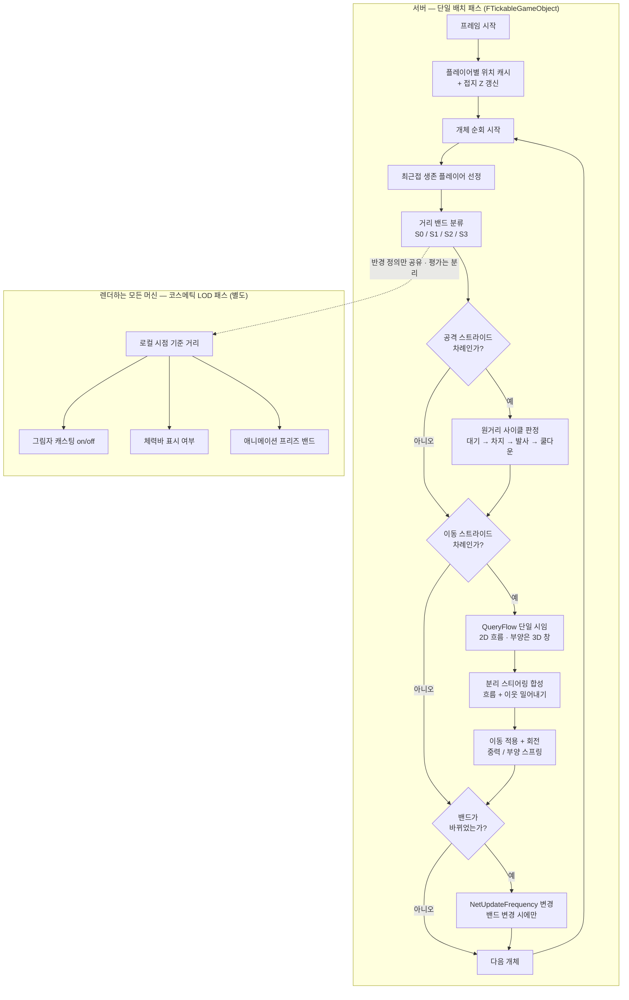
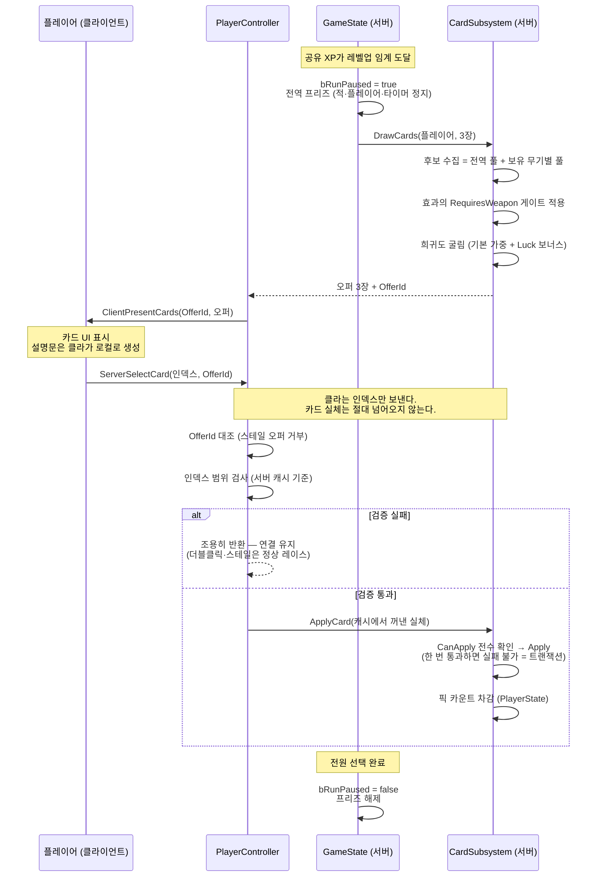

# FPSRoguelite

## 목차

1. [프로젝트 개요](#1-프로젝트-개요)
2. [개발 프로세스 — Notion 보드로 일감을 나누고 추적한다](#2-개발-프로세스--notion-보드로-일감을-나누고-추적한다)
3. [언리얼 엔진 기능을 쓴 곳](#3-언리얼-엔진-기능을-쓴-곳)
4. [엔진 밖에서 직접 만든 것 — 왜, 그리고 무엇을 포기했나](#4-엔진-밖에서-직접-만든-것--왜-그리고-무엇을-포기했나)
5. [스웜 시스템 분석](#5-스웜-시스템-분석)
6. [카드 시스템 분석](#6-카드-시스템-분석)
7. [빌드 · 검증](#7-빌드--검증)
8. [저장소 구조 · 문서 지도](#8-저장소-구조--문서-지도)

---

## 1. 프로젝트 개요

### 1.1 제1원리 — 다수의 적 비용 절감

모든 아키텍처 결정의 기준은 하나다:

> **적을 동시 200~300마리 사용한다. 액터당 비용 최소화가 다른 모든 편의보다 우선한다.**

이 한 문장이 아래 §4의 자체 구현 9건 전부의 근거다. 엔진 기본값은 "액터가 수십 개"라는 전제 위에 서 있는 경우가 많고, 그 전제가 깨지는 지점에서만 직접 만들었다. 그렇지 않은 곳은 전부 엔진 것을 그대로 쓴다(§3).

## 2. 개발 프로세스 — Notion 보드로 일감을 나누고 추적한다

### 2.1 왜 git 문서가 아니라 Notion인가

처음에는 `PROGRESS.md` 하나에 작업 현황을 적었다. 그러다 실제 사고가 났다 — **다른 세션의 커밋이 내 phase 브랜치에 얹혔다.** 원인은 단순했다.

> **git 문서는 브랜치-로컬이다. 머지되기 전에는 병렬 작업자끼리 서로가 안 보인다.**
> → **공유 가변 상태는 git 밖에 살아야 한다.**

작업 현황·우선순위·선행관계·핸드오프의 SSOT를 전부 Notion DB로 이관했다. `PROGRESS.md`는 보드로 가는 포인터만 남겼다. 설계 문서(변하지 않는 결정)는 git에, 작업 현황(계속 변하는 상태)은 Notion에 — **성질이 다른 두 데이터를 같은 저장소에 두지 않는다**는 것이 이관의 논지다.

**하드 게이트**: 커밋을 낳는 작업은 **보드 클레임 없이 착수 금지**. 이 규칙이 없으면 보드는 반쯤 비어 있는 채로 신뢰를 잃는다.

### 2.2 보드 스키마 — 4개 축

작업 1건은 서로 직교하는 4개 축으로 기술된다.

| 축 | 값 | 의미 |
|---|---|---|
| **상태** | 대기 / 진행중 / **검증중** / **결정대기** / 차단 / 보류 / 완료 / **폐기** | 지금 무엇을 기다리는가 |
| **우선순위** | 크리티컬 / 하이 / 미듐 / 로우 / 백로그 | 그 마일스톤 *안*에서의 순서 |
| **마일스톤** | M0 기준선 … M6 정식 1.0 | 언제 — 슬라이스 순서 |
| **크기** | S / M / L / XL | 상대 크기 (달력 기간이 **아니다**) |

축을 나눈 이유가 각각 있다.

- **`검증중`** — 사람이 PIE·에디터에서 직접 확인해야 끝나는 것. 자동화가 집을 수 없는 작업이라 세션 시작 조회에서 **일부러 제외**한다. 넣었더니 활성 목록이 17건 → 29건으로 불어 신호를 잃었다.
- **`결정대기`** — 진행이 막힌 게 아니라 **사람의 결정을 기다리는** 상태. `차단`과 섞으면 "내가 답하면 풀리는 것"이 안 보인다.
- **`완료` vs `폐기`** — 원래는 `폐기`가 없어서, 접은 트랙도 `완료`로 넣고 사유를 본문에 적는 우회를 썼다. 그러면 나중에 **"완료 = 실제로 해낸 것"으로 셀 수 없다.** 이제 갈라 쓴다. 폐기 행은 지우지 않는다 — 지우면 "왜 안 했는지"가 사라져 같은 걸 다시 착수하게 된다.
- **`크리티컬`은 사람 전용** — 에이전트가 스스로 부여하거나 강등할 수 없다. 유일하게 마일스톤 순서를 무시하는 인터럽트라 권한을 나누면 순서 규율이 무너진다.

**클레임 7단계**(조회 → 크리티컬 확인 → 행 확보 → 선행 확인 → 병렬 충돌 검사 → 클레임 → **경합 재확인**)에서 마지막 단계가 특히 중요하다. **Notion에는 트랜잭션이 없다.** 클레임 직후 행을 다시 읽어 담당이 나인지 확인하지 않으면, 동시에 같은 행을 집은 다른 세션의 값이 조용히 내 값을 덮는다.

### 2.3 보드는 stale해진다 — 드리프트 감사

보드는 사람이 갱신을 빠뜨리면 틀린다. 그래서 **git이 1차 진실**이고, 보드는 git과 주기적으로 대조한다.

| | 감사 항목 |
|---|---|
| D1 | 유령 진행중 — 브랜치 칸이 비었거나 그 브랜치가 실재하지 않음 |
| D2 | 정체 — 브랜치는 있으나 최근 커밋이 없음 |
| D3 | 완료 미머지 — `완료커밋` 해시가 `main`에 없음 |
| D4 | 머지 미마킹 — `main`에 머지됐는데 행이 아직 진행중 |
| D5 | 선행 해제 누락 — 선행이 완료됐는데 후행이 아직 차단 |
| D6 | 크리티컬 미착수 |
| D7 | 경합 — 진행중 행끼리 `주요경로` 공유 |

### 2.4 문서 계층 — 무엇을 어디에 적는가

작업 현황(Notion)과 별개로, **git에는 변하지 않는 것**을 적는다. 종류별로 목적지가 다르고, 같은 내용을 두 곳에 적지 않는다(이중 SSOT 금지).

| 문서 | 담는 것 | 성질 |
|---|---|---|
| [`Game.md`](Game.md) | SSOT 허브 — 장르 정체성 + **라우팅 가이드**(작업 종류 → 읽을 파일) | 얇게 유지 |
| [`Docs/SSOT/*.md`](Docs/SSOT) | 도메인별 설계 정본 (전투·적·성능·런루프·아트·워크플로 등 12개) | 설계가 바뀌면 **코드보다 먼저** 갱신 |
| [`Docs/Architecture/*.md`](Docs/Architecture) | **ADR** — 결정 + 그 이유 + **기각된 안** + **미해소 반론** | 뒤집혀도 **고치거나 지우지 않는다** |
| [`Docs/WorkLog.md`](Docs/WorkLog.md) | 끝난 작업의 상세 경위 (최신순, 원문 보존) | append only |
| [`Docs/Troubleshooting.md`](Docs/Troubleshooting.md) | 증상 → 원인 → 해결 | 막히면 여기부터 |

### 2.7 AI 어시스트 워크플로

이 프로젝트는 AI 에이전트를 개발에 상시 사용하고, **Human-on-the-Loop** 규약 아래 운용한다. 읽기·조사·초안은 자동으로 돌지만, 파일 수정·커밋·외부 호출 같은 고위험 작업은 사람의 승인을 거친다.

핵심 안전장치는 **머지 전 적대 코드리뷰 게이트**다. 코어·구조 변경은 머지 직전에 별도 인스턴스의 리뷰어가 diff를 공격적으로 검토하며, **설계 변호를 리뷰 프롬프트에 싣지 않는 것**이 독립성의 성립 조건이다. 심각도 P1이 하나라도 남아 있으면 머지가 금지되고, 지적을 기각하려면 근거(제1원리 조항 / 코드 인용 / 실측치)를 대야 한다. **지적 0건은 통과 근거로 인정하지 않는다** — 무엇을 봤는지가 비어 있으면 리뷰가 돌지 않은 것으로 본다.

---

## 3. 언리얼 엔진 기능을 쓴 곳

액터가 소수(플레이어 1~4, 보스 1)인 영역에서는 엔진 표준을 그대로 쓴다. 직접 만든 것은 §4에만 있고, 그 경계는 **"적 수백 마리가 지나가는 경로인가"** 하나다.

| 엔진 기능 | 어디에 | 
|---|---|
| **Gameplay Ability System** | 플레이어 전원(ASC는 `PlayerState` 소유) + 엘리트 적. 무기 발사 GA 4종(히트스캔 / 발사체 / 차지레이저 / 근접), 글로벌 어트리뷰트(Luck·Crit·MoveSpeed·MaxHealth·PickupRadius·XPGain) | 
| **Enhanced Input** | 이동·사격·ADS·대시·무기 슬롯 1/2/3 | 
| **CommonUI** + Activatable Widget Stack | 메뉴 · 로비 · 카드 선택 · 설정 오버레이 · HUD | 
| **Push Model 복제** | 적 체력 3개 프로퍼티, 무기 인벤토리, 런 상태(`bRunPaused`·공유 XP) | 
| **CharacterMovementComponent** | 플레이어 이동 전체 (+ 서브클래스로 슬라이드·월 동작·충돌무시 대시) | 
| **`CustomPrimitiveData`** + Mesh Draw Command 동적 인스턴싱 | 적 애니메이션 상태 전달 (§4.7) | 
| **OnlineSubsystem (Steam)** + SteamSockets | 리슨 서버 호스팅, Steam 친구 초대 join, 세션 정리 | 
| **DataValidation** (`IsDataValid`) | 무기·카드 풀·런 스케줄·로드아웃 DataAsset 불변식 검사 | 
| **Automation Testing** | 61개 — Flow-Field 알고리즘, 풀 수명주기, 예산 산술, 카드 CSV 왕복, 세이브 버전, 스테이지 전환 | 
| **Slate / 에디터 모듈** | `FPSRogueliteEditor` — Data Editor · 아레나 저작 툴 · 무기 조립기 · 블록아웃 배치 모드 |
| **SaveGame** | 버전드 `USaveGame` + 강제 경유 `GameInstanceSubsystem` |
| **GameplayTag** | 데미지 타입 · 코스메틱 채널 · HUD 상태 |

---

## 4. 엔진 밖에서 직접 만든 것 — 왜, 그리고 무엇을 포기했나

전부 §1.2의 제1원리에서 나왔다. 각 항목은 `문제 → 엔진 기본안 → 왜 안 되나 → 자체 구현 → 포기한 것` 순이다.

### 4.1 길찾기 = Flow-Field (NavMesh + BehaviorTree 대체)

- **엔진 기본안**: NavMesh + `AIController` + BehaviorTree, 개체마다 `MoveTo`
- **왜 안 되나**: 개체별 경로 탐색은 마릿수에 선형으로 붙고, `AIController`는 적 1마리당 액터 하나를 더 만든다. 200~300마리에서는 둘 다 성립하지 않는다
- **자체 구현**: 고정 맵을 격자로 나눠 플레이어에서 출발하는 BFS로 거리장을 만들고, 그 기울기를 흐름 벡터로 굽는다. 적은 자기 칸의 벡터를 **O(1) 샘플**로 읽어 그 방향으로 밀린다. 재계산은 0.2초 주기 + 지형 변화(문 파괴 등) 시 해당 칸을 `blocked→open`으로 stamp 후 단일 BFS 재실행
- **분리 설계**: 격자·BFS·흐름 알고리즘은 월드를 모르는 순수 클래스(`UFPSRFlowFieldComputer`)로 빼서 단위 테스트가 가능하다. 월드 서브시스템은 경계 볼륨 발견·타이머·라우팅만 소유

### 4.2 적 체력 = 비-GAS 경량 컴포넌트

- **엔진 기본안**: GAS `AttributeSet` + `GameplayEffect`로 데미지
- **왜 안 되나**: 적 1마리마다 ASC + AttributeSet + GE 핸들이 붙는다. ASC 하나의 복제 비용(어트리뷰트 셋 + 어빌리티 스펙 + GE 핸들)은 일반 티어가 쓰는 `UActorComponent` 하나를 압도한다
- **자체 구현**: `UFPSREnemyHealthComponent` — 단순 `UActorComponent` 하나. 데미지는 GAS를 거치지 않고 `FPSRCombatStatics::ApplyDamage` 단일 지점으로 들어온다. 플레이어 쪽 GAS 계산(크리티컬·배율)의 **결과값만** 이 브릿지로 넘어온다. 실드 층·약점 판정도 여기에 얹었다

### 4.3 시뮬레이션 = 배치 틱 + 직접 짠 거리 밴드 significance

- **엔진 기본안**: 액터별 `Tick` + `SignificanceManager` 플러그인
- **왜 안 되나**: 액터별 Tick은 300개의 개별 함수 호출 + 캐시 미스다. `SignificanceManager`는 범용이라 우리가 필요한 것(**이동 스트라이드·공격 스트라이드·복제 주파수를 한 번에 결정**)과 모양이 맞지 않는다
- **자체 구현**: 적의 `Tick`을 전부 끄고, 스폰 서브시스템이 `FTickableGameObject`로 **한 패스에 전 개체를 순회**한다. 그 패스가 거리 밴드를 계산해 세 소비처를 동시에 결정한다 (§5.3)

### 4.4 액터 수명 = 풀링 + 휴면 풀

- **엔진 기본안**: `SpawnActor` / `Destroy`
- **왜 안 되나**: 초당 수십 마리가 죽고 태어나는 게임에서 스폰·소멸은 GC 압력과 히치로 직결된다
- **자체 구현**: 스폰 서브시스템 안에 풀을 인라인. 죽은 적은 파괴되지 않고 숨겨진 채 **클래스별 버킷**으로 들어가, 같은 아키타입 요청 시 O(1)로 나온다. 죽음 직후에는 시체가 잠시 남았다가(dwell) 풀로 돌아간다
- **`Mass`/ISM을 안 쓴 이유**: 실측 결과 풀 액터가 예산 안에 들어왔다(§5.5). 인스턴싱 전환이 요구하는 수명주기 기구(슬롯 핸들·generation·이주·단일 기록자)를 **필요하지 않은데 미리 지불하지 않는다**. 규모가 수천 단위로 바뀌면 그때 꺼내 쓸 수 있게 설계는 문서로만 보존했다

### 4.5 메시징 = GameplayMessageSubsystem 경량 재구현

- **엔진 기본안**: Lyra의 `GameplayMessageRouter` 플러그인 — **엔진에 포함되어 있지 않다**
- **자체 구현**: 태그 채널 기반 로컬 pub/sub 서브시스템. 정확 매칭 / 하위 태그 포함 매칭 2종, 핸들 기반 해제. **복제 0** — 히트·사망 코스메틱이 이 위로 다니고, 복제되는 액터 상태로 승격되지 않는다
- **왜 중요한가**: 코스메틱을 복제 상태로 만들면 적 300마리의 이펙트가 전부 대역폭이 된다. 로컬 버스로 내리면 0이 된다

### 4.6 부양 적 = 플레이어 중심 국소 3D 창 필드 ([ADR 0009](Docs/Architecture/0009-hover-swarm-local-3d-flow-window.md))

- **문제**: 2D 흐름장은 평면만 안다. 떠다니는 적이 건물을 넘거나 단차를 오르게 하려면 세로 정보가 필요하다
- **자체 구현**: 2D 전역 필드는 그대로 두고, **플레이어 주위에만 작은 3D 창**을 띄워 그 안에서만 세로를 푼다. 목표 고도는 플레이어의 **마지막 접지 Z**(순간 Z가 아니라)로 잡아 점프 동조를 구조적으로 없앴다. 이동 소비자가 필드를 읽는 지점은 `QueryFlow` **단 하나**로 좁혀, 뒤의 필드를 갈아끼워도 국소 수정으로 끝나게 했다

### 4.7 렌더 = CustomPrimitiveData ([ADR 0007](Docs/Architecture/0007-enemy-swarm-render-path-cpd.md))

- **문제**: 적 300마리에게 서로 다른 애니메이션 상태(대기/이동/공격/사망 + 진입 시각 + 재생률 + 위상)를 전달해야 한다
- **자체 구현**: 개별 `StaticMeshComponent`를 그대로 두되 **머티리얼은 전 개체가 공유**하고, 상태는 `CustomPrimitiveData` 슬롯 5개로 per-primitive 전달. UE5의 Mesh Draw Command 동적 인스턴싱은 같은 메시+같은 머티리얼 컴포넌트를 병합하며, **CPD는 그 병합을 보존하는 통로**다. 엔진 기본 경로를 덮지 않고 그대로 쓴다

### 4.8 저작 도구 = 전용 에디터 모듈

밸런스 값이 전부 DataAsset에 있으면 **바꾸기는 쉬운데 한눈에 보기가 어렵다.** 그래서 별도 에디터 모듈(`FPSRogueliteEditor`)을 만들었다.

| 도구 | 하는 일 |
|---|---|
| **FPSR Data Editor** (Slate) | 카드·무기·풀 값을 격자로 놓고 **일괄 산술**. 단위가 섞인 선택(퍼센트 + 플랫)에는 덧셈을 금지한다 |
| **카드 CSV 파이프라인** | `Cards.csv` + `CardCatalog.csv` → 커맨드릿 임포트 → DataAsset. 왕복 테스트로 무손실 보장 |
| **아레나 저작 툴 + 검증기** | 아레나 골격을 저작하고 불변식을 **저작 시점에** 검사 |
| **무기 조립기** (전용 뷰포트 2종) | 모듈러 파츠를 붙이고 1인칭 시점으로 바로 확인 |
| **블록아웃 배치 모드** | 레벨 화이트박스 배치 + 검증 |
| **검증기 6종** | 카드 풀(ID 중복 = 세이브 키 충돌) · 무기 · 로드아웃 · 런 스케줄 · 아레나 베이크 · 블록아웃 |
| **로컬라이징 커맨드릿** | CSV → StringTable, 에디터 실행 중 리로드 |

### 4.9 서버 RPC 규약 = `WithValidation` 미채택

- **엔진 기본안**: Server RPC에 `_Validate`를 달아 잘못된 입력을 거른다
- **왜 안 되나**: UE 5.7 엔진 소스를 따라가면 `_Validate`가 false를 반환할 때 벌어지는 일은 "걸러내기"가 아니다.
  `RPC_ValidateFailed`(`CoreNet.cpp`) → `ReceivedRPC` false(`DataReplication.cpp`) → **`Connection->Close(...)`**(`DataChannel.cpp`) — **강제 퇴장**이다
- **결정적 근거**: 거부 사유의 절반은 악의가 아니라 **정상 레이스**다. 스테일 오퍼, 더블클릭. `_Validate`로 올리면 **더블클릭한 정상 플레이어가 킥된다**
- **자체 규약**: 검사는 `_Implementation` 몸통에서 하고, 유효하지 않으면 **아무 일도 하지 않고 반환**한다. 클라이언트는 **인덱스만** 보내고 실체(카드·무기)는 서버가 자기 캐시에서 꺼낸다 — 실체 주입이 구조적으로 불가능하다

---

## 5. 스웜 시스템 분석

### 5.1 서버 1패스 파이프라인

적은 개별 `Tick`을 갖지 않는다. 스폰 서브시스템 하나가 프레임마다 전 개체를 순회하며 아래를 처리한다.



**두 패스를 나눈 것이 설계의 핵심이다.** 서버 significance는 "누가 위협인가"를, 코스메틱 LOD는 "누가 보고 있는가"를 답한다. 멀티플레이에서 이 둘은 다른 질문이라 합칠 수 없다.

### 5.2 예산 3층

동시 마릿수 상한이 **세 개의 다른 층**에 있고, 각각 뜻이 다르다. 이 구분이 문서에서 한 번 뭉개져 있었고, 감사에서 정정했다.

| 층 | 값 | 뜻 |
|---|---|---|
| ① `MaxActiveEnemies` | **500** | **풀 액터 상한**. 누적 스폰 기준이며 **동시 생존 상한이 아니다** |
| ② `GlobalAliveCap` − `SeedReserve` | 250 − 10 = **240** | **동시 생존 실효 천장.** 모든 스폰 경로가 통과하는 하드 게이트 = 엔지니어링 천장. 실측으로만 움직인다 |
| ③ `MaxAliveCount` (DataAsset) | 240 (C++ 기본값) | 디자이너가 **더 조일 수만 있는** 운영 상한. 현재 런 스케줄 애셋에 저작된 적이 없어 기본값 그대로다 |
| — `EliteHardCap` | **8** | 엘리트 동시 마릿수. 곡선과 무관하게 이 값을 못 넘는다 |

- **`SeedReserve` 10의 이유**: 예산이 포화된 상태에서도 새 전선이 열리면 즉시 적을 뿌릴 헤드룸이 필요하다. 없으면 진입 직후 몇 초가 비어 버린다
- **`EliteHardCap` 8의 이유**: 엘리트는 ASC를 갖는다. 어트리뷰트 셋 + 어빌리티 스펙 + GE 핸들의 복제 비용이 일반 티어의 `UActorComponent` 하나를 압도한다. 캡이 없으면 §1.2의 제1원리가 무너진다

### 5.3 거리 밴드 LOD — 하나의 분류가 세 곳을 결정한다

| 밴드 | 거리 | 이동 스트라이드 | 공격 스트라이드 | 복제 주파수 |
|---|---|---|---|---|
| **S0** 근접 위협 | ≤ 15m | 1 (매 프레임) | 1 | 30Hz |
| **S1** 근거리 | ≤ 35m | 2 | 1 | 10Hz |
| **S2** 중거리 군집 | ≤ 60m | 4 | 2 | 5Hz |
| **S3** 원거리 | > 60m | 8 | 4 | 2Hz |

- **공격 스트라이드가 항상 이동 스트라이드 이하**인 이유: 공격 지연은 이동 지연보다 체감이 크다. 그리고 원거리 교전 사거리가 S1 안에 들어와 있어 **차지는 언제나 스트라이드 1에서 일어난다**
- **위상 분산**: 스트라이드 게이트는 `(프레임 카운터 + 개체 고유 ID) % 스트라이드`로 판정한다. 개체 ID를 더하지 않으면 같은 밴드의 적이 **전부 같은 프레임에** 깨어나 스파이크가 된다
- **복제 주파수는 밴드가 바뀔 때만 쓴다** — 300마리 핫패스에서 매 프레임 setter를 부르지 않는다

### 5.4 복제 계약 — 딱 3개

적이 복제하는 것은 **Transform + 체력 컴포넌트의 3개 프로퍼티**(`Health` · `MaxHealth` · `bDead`)뿐이고, 전부 Push Model이다.

- `MaxHealth` — 클라이언트가 체력바 **비율**을 계산하려면 필요하다. 스폰 때 한 번만 바뀌므로 지속 비용은 사실상 0
- `bDead` — `Health <= 0`에서 파생 가능한데도 남긴다. **풀 재사용 때 `true→false` 전이를 클라이언트가 놓치지 않게 하는 엣지 감지**용이다. *비트 하나보다 엣지 감지 정확성이 우선* — 적을 재사용하는 구조라 놓친 전이는 곧 유령 시체·체력바 잔존으로 나타난다
- 히트·사망 코스메틱은 복제 상태가 아니라 **로컬 메시지 버스**로 다닌다 (§4.5)

## 6. 카드 시스템 분석

레벨업·미션 클리어마다 **전역 프리즈**를 걸고 전원이 카드를 고른다. 런 내 성장의 전부가 이 시스템 위에 있다.

### 6.1 구조 — 폴리모픽 효과 (개방-폐쇄 원칙)

카드는 효과를 **직접 알지 않는다.** 추상 베이스 `UFPSRCardEffect`의 인라인 서브오브젝트 배열을 소유할 뿐이고, 적용 루프는 타입을 모른 채 `ResolveMagnitude` → `Apply`만 돈다.

| 효과 서브클래스 | 하는 일 |
|---|---|
| `Character: Gameplay Effect` | 플레이어 ASC에 GE 적용 (`SetByCaller`로 수치 주입) |
| `Character: Passive Ability` | 패시브 어빌리티 부여 |
| `Weapon: Stat Modifier` | 무기 스탯 수정 (이 무기만 / 전 무기 선택 가능) |
| `Weapon: Behavior Fragment` | 무기에 행동 조각 부여 (관통·폭발·도트 등) |
| `Grant Weapon (Unlock)` | 새 무기 해금 |

> **새 효과 타입을 추가하는 비용 = 서브클래스 1개(약 40줄), 중앙 코드 수정 0.**

이게 말뿐이 아닌 이유는, 확장 지점이 **런타임뿐 아니라 에디터 툴까지** 가상 함수로 뚫려 있기 때문이다. 새 서브클래스가 `GetEditorEligibleRoutes()`(어느 드로우 루트에 놓일 수 있는가) · `GetEditorMagnitudeUnit()`(퍼센트인가 플랫인가)만 구현하면, Data Editor의 라우팅 프리플라이트와 일괄 산술 안전장치에 **자동으로 편입**된다. 중앙에 `switch`가 하나도 없다.

**수치는 효과별로 매긴다.** 카드는 희귀도 하나를 굴리지만 각 효과가 자기 `RarityTiers`에서 자기 수치를 읽으므로, 한 카드 안에서 *"연사 +15% / 데미지 −8%"* 처럼 서로 다르게 스케일하는 게 가능하다.

### 6.2 라우팅 2축 — 어디서 뽑히고 무엇을 소비하는가

**드로우 루트**(카드가 어느 배열에 사는가)는 C++ 멤버라 **닫힌 집합**이고, **효과**는 열린 축이다. 효과가 자신이 허용하는 루트를 선언하고, 도구가 그 교집합을 검사한다.

| 드로우 루트 | 언제 뽑히는가 |
|---|---|
| `LevelUpGlobal` | 레벨업 — 전역 풀 (캐릭터 / 전 무기 대상) |
| `LevelUpWeapon` | 레벨업 — **보유한** 무기의 전용 풀 |
| `MissionClearNewWeapon` | 미션 클리어 — 새 무기 해금 |
| `MissionClearWeaponFeature` | 미션 클리어 — 무기 기능 해금 |

| 오퍼 타입 | 소비 | 리롤 |
|---|---|---|
| `OpeningSeed` | 런 시작 시드 2장 — **아무것도 소비하지 않는다** | 가능 |
| `LevelUp` | 레벨업 픽 1개 소비 | 가능 |
| `WeaponUnlock` | 무기 해금 픽 1개 소비 | **불가** |

**희귀도 × Luck**: 풀이 등급별 기본 가중치를 갖고, 플레이어의 Luck 어트리뷰트가 등급별 보너스를 더한다. Luck은 광역 행운으로 통합되어 있어(별도 RarityBonus는 폐지) 앞으로 드랍 품질·희귀 스폰에도 같은 스탯이 쓰인다.

### 6.3 서버 권위 흐름



세 가지가 이 흐름의 핵심이다.

1. **클라이언트는 인덱스만 보낸다.** 카드·무기 실체는 서버 캐시에서 꺼낸다 — 실체 주입이 **구조적으로 불가능**하다
2. **거부는 조용히 한다.** 스테일 오퍼·더블클릭은 악의가 아니라 정상 레이스다 (§4.9)
3. **적용은 트랜잭션이다.** `CanApply()`가 완전한 사전조건 검사를 하므로 `Apply()`는 실패할 수 없다. 이게 없으면 "픽은 소비됐는데 효과가 안 붙은" 상태가 생기고, 프리즈가 풀리지 않아 **소프트락**이 된다

**전역 프리즈**(`bRunPaused`)는 서버 권위 플래그 하나지만, 이걸 존중해야 하는 곳이 많다. 반동 컴포넌트는 프리즈 중 카메라를 드리프트시키면 안 되고, 진행 중인 타이머는 명시적으로 일시정지해야 하며, **클라이언트와 서버 양쪽에 게이트가 필요**하다. 한쪽만 걸면 예측과 권위가 갈라진다.

### 6.4 저작 파이프라인 — CSV가 원천

카드가 수십~수백 장이 되면 DataAsset을 하나씩 여는 건 성립하지 않는다.

```
Cards.csv          ─┐
  카드 1장 = 1행     │
  효과는 E1~E3       ├─→  임포트 커맨드릿  ─→  DA_Card_*.uasset
  컬럼군으로 평탄화   │         │
CardCatalog.csv    ─┘         │
  AttrId → 효과 타입 매핑      ↓
  (char.maxhealth 등)     검증기 · 라운드트립 테스트
```

- **`CardId`가 세 역할을 겸한다** — CSV 행 키 · **세이브 파일 키** · 로컬라이징 키 접두. 그래서 풀 검증기가 **ID 중복을 에러로 잡는다**(중복 = 세이브에서 해금이 서로를 덮어씀)
- **표시 문자열은 CSV가 원천**이고 DataAsset에는 StringTable 참조가 들어간다 — 한/영/일 3개 열
- **왕복 테스트**(`FPSRCardCsvRoundTripTest`)가 export → import → export 무손실을 보장한다
- **Data Editor의 라우팅 프리플라이트**: 부적격 루트에 카드를 놓으면 런타임에 **조용한 no-op**이 된다(뽑히지 않거나 의미 없는 오퍼가 됨). 조용한 실패는 디버깅이 가장 비싸므로 **경고가 아니라 하드 에러**로 막는다

### 6.5 트레이드오프

| 얻은 것 | 대가 |
|---|---|
| 효과가 인라인 서브오브젝트라 **복제 0** — 카드 정보가 네트워크를 타지 않는다 | 카드 애셋이 커지고, 항상 로드된 상태여야 한다 |
| 새 효과 = 서브클래스 1개, 중앙 0 수정 | 폴리모픽 `Instanced`는 UObject 직속 `TArray`에서만 쓴다(struct 중첩은 이 리포에서 미검증이라 회피) |
| 밸런스 값이 전부 데이터 — 코드 재빌드 없이 조정 | 값이 흩어져 **도구 없이는 밸런싱이 불가능** → 그래서 §4.8을 만들었다 |
| 클라이언트가 설명문을 로컬 생성 — 텍스트 복제 0 | 서버·클라이언트가 같은 수치 해석 규칙을 각자 돌린다(어긋나면 표시만 틀림) |

---

<sub>본 저장소는 개인 개발 중인 프로젝트입니다. 사용된 상용 에셋 팩과 엔진 플러그인은 각 배포처의 라이선스를 따릅니다.</sub>
